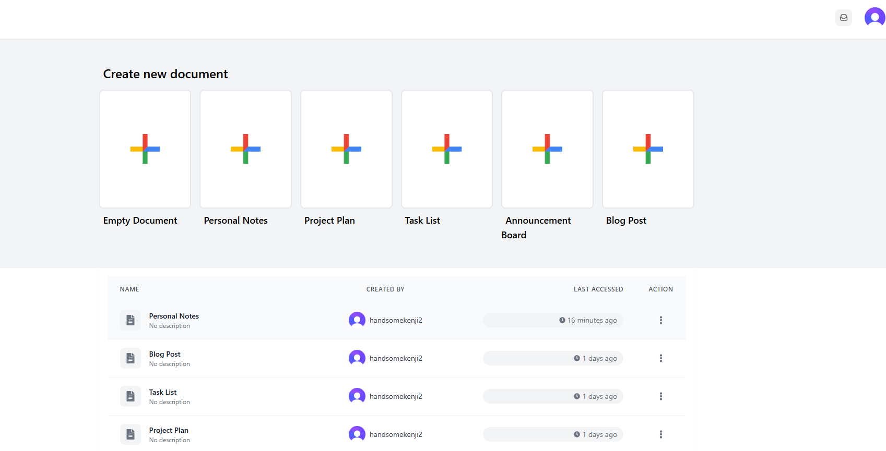

# Cilis Docs

Cilis Docs is an immersive, cloud-first collaborative editor designed to bring teams together in real time. Harnessing the power of CRDTs and advanced editing tools, it ensures every keystroke, comment, and cursor movement is instantly shared across collaborators. With a sleek, intuitive interface and robust feature set, Cilis Docs transforms the way you co-create, feedback, and deliver content—whether you’re drafting proposals, brainstorming ideas, or refining documentation.

---

## 🎥 Preview



---

## 🚀 Features

* **Real-time Collaboration**: Multiple users can edit documents simultaneously, with live cursor presence and instant updates.
* **Rich Text Editing**: Full support for text formatting, headings, lists, tables, task lists, and more.
* **Image Support**: Insert, resize, and position images directly within the document.
* **Document Templates**: Start new documents from a variety of built‑in templates for different use cases.
* **Document Management**: Easily create, view, rename, and delete documents from the dashboard.
* **User Authentication**: Secure sign‑up and sign‑in powered by Clerk.
* **Access Control**: Grant view or edit permissions to individual users or teams.
* **Commenting & Discussions**: Threaded comments for in‑document discussions and feedback.

---

## 🛠️ Technology Stack

### Frontend

* **Next.js** (React framework)
* **TipTap** (Rich text editor)
* **Tailwind CSS** (Utility‑first styling)
* **Framer Motion** (Smooth animations)

### Collaboration Layer

* **Liveblocks** (Real‑time collaboration infrastructure)
* **Yjs** (CRDT engine for conflict‑free text editing)

### Backend

* **Next.js API Routes** (Serverless endpoints)
* **MongoDB** (Document storage)
* **Clerk** (Authentication)

---

## 🏁 Getting Started

Follow the steps below to get Cilis Docs up and running locally.

### 1. Clone the repository

```bash
git clone https://github.com/HuynhDucVo/cilisdocs.git
cd cilis-docs
```

### 2. Install dependencies

Choose your package manager:

```bash
npm install      # or
yarn install     # or
bun install
```

### 3. Set up environment variables

Create a `.env.local` file in the project root with the following keys:

```dotenv
# Clerk Authentication
NEXT_PUBLIC_CLERK_PUBLISHABLE_KEY=your_clerk_publishable_key
CLERK_SECRET_KEY=your_clerk_secret_key

# MongoDB
MONGODB_URI=your_mongodb_connection_string

# Liveblocks
LIVEBLOCKS_SECRET_KEY=your_liveblocks_secret_key
NEXT_PUBLIC_LIVEBLOCKS_PUBLIC_KEY=your_liveblocks_public_key
```

### 4. Run the development server

```bash
npm run dev      # or
yarn dev         # or
bun dev
```

Open [http://localhost:3000](http://localhost:3000) in your browser to view the app.

---

## 📝 Usage

* **Sign In**: Authenticate with your Clerk‑managed account.
* **Create Document**: Choose a template or start from a blank document.
* **Collaborate**: Invite collaborators, see their cursors, and edit together in real time.
* **Format Content**: Use the toolbar to apply styles, insert tables, images, and more.
* **Comment & Discuss**: Highlight text and leave threaded comments for feedback.

---

## 🎉 Contributing

Contributions are welcome! Please open issues and pull requests for any improvements or bug fixes.

---

## 📝 License

This project is licensed under the MIT License. See the [LICENSE](LICENSE) file for details.
